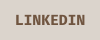
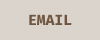

##  
 👋 Hi! I’m `@giomfb07`, welcome to my `GitHub profile`!

   
  

 
 

💻 I have experience in both front-end and back-end!

🎓 Currently studying at Cotemig (IT technical school).

🎨  I'm interested in working in UI/UX design!

  
 
 

##  📊 Statistics  
 

  

##  👩‍💻 Languages and Tools  

           
 
 

 

